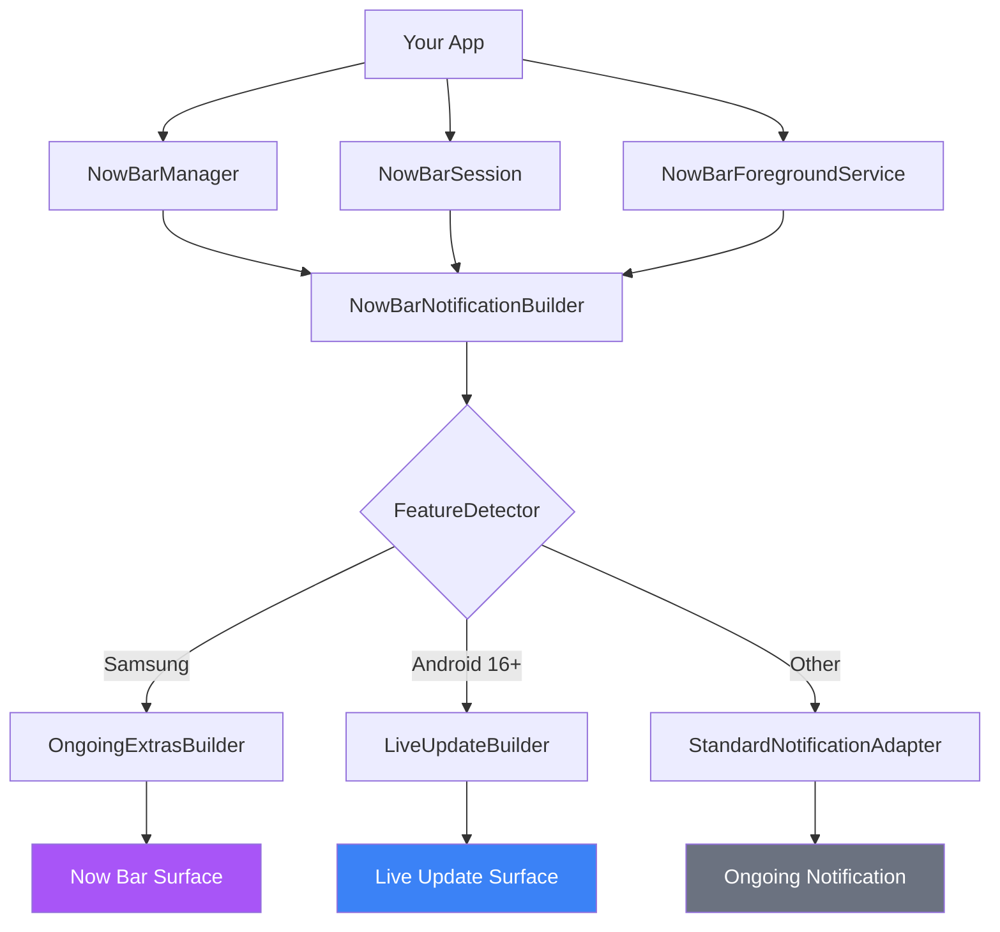
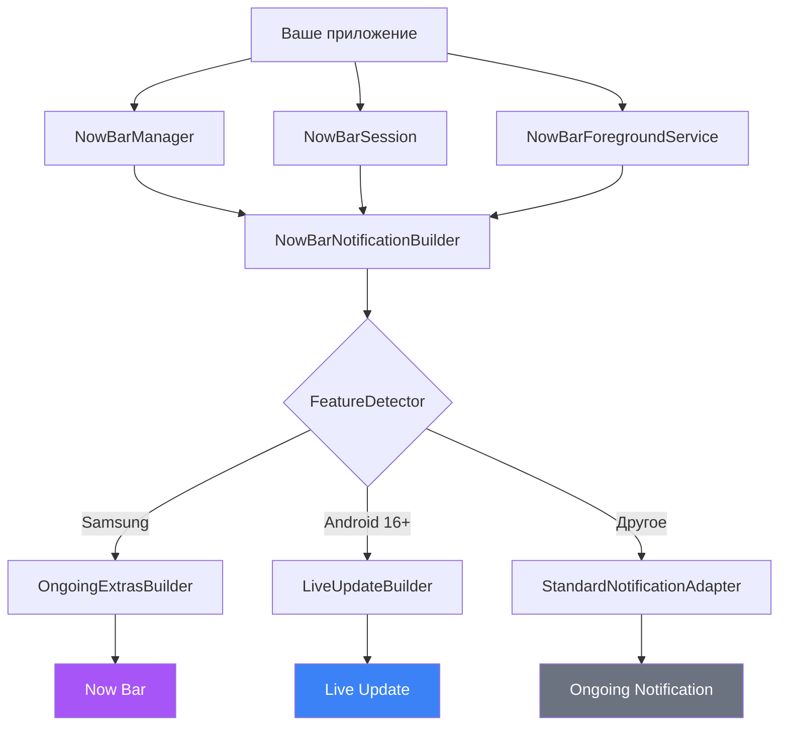
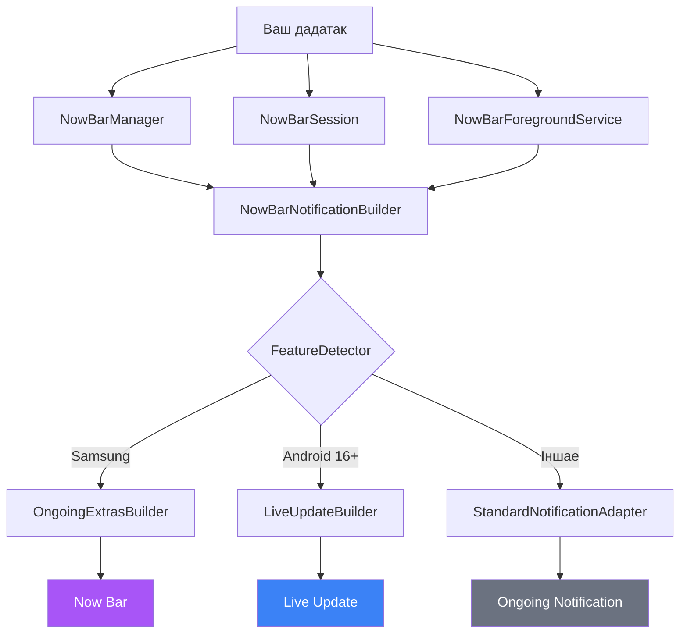

# NowBar SDK

<p align="center">
  
</p>

<p align="center">
  
  
  
  
  
</p>

<p align="center">
  <a href="#english">🇬🇧 English</a>
  ·
  <a href="#ukrainian">🇺🇦 Українська</a>
  ·
  <a href="#russian">🇷🇺 Русский</a>
  ·
  <a href="#belarusian">🇧🇾 Беларуская</a>
</p>

---

<a id="english"></a>

## 🇬🇧 English

`nowbar-sdk` is a portable Android library module built around the `com.nowbar.api` package. It gives you one API for creating, updating, dismissing, and stopping ongoing Now Bar / Live Update style surfaces.

### Highlights

| Capability | Details |
| --- | --- |
| Native surfaces | Samsung Now Bar and Android 16 Live Updates |
| Fallback | Standard ongoing notification via `FallbackStrategy` |
| Integration style | Copy the [`nowbar/`](./nowbar) module into your project |
| Entry points | Direct manager API, session API, foreground service helper |

### Architecture



### Card Types

| Card | Use Case | Samsung extras | Live Updates |
| --- | --- | :---: | :---: |
| [`TimerCard`](./nowbar/src/main/kotlin/com/nowbar/api/cards/TimerCard.kt) | Countdown / stopwatch | ✅ | ✅ |
| [`WorkoutCard`](./nowbar/src/main/kotlin/com/nowbar/api/cards/WorkoutCard.kt) | Fitness tracking | ✅ | ✅ |
| [`MediaCard`](./nowbar/src/main/kotlin/com/nowbar/api/cards/MediaCard.kt) | Music / podcast playback | ✅ | ✅ |
| [`CallCard`](./nowbar/src/main/kotlin/com/nowbar/api/cards/CallCard.kt) | Incoming / active calls | ✅ | ✅ |
| [`NavigationCard`](./nowbar/src/main/kotlin/com/nowbar/api/cards/NavigationCard.kt) | Turn-by-turn navigation | ✅ | ✅ |
| [`CustomCard`](./nowbar/src/main/kotlin/com/nowbar/api/cards/CustomCard.kt) | Any custom scenario | ✅ | ✅ |

### Core API

| API | Purpose |
| --- | --- |
| [`NowBarManager`](./nowbar/src/main/kotlin/com/nowbar/api/NowBarManager.kt) | Feature detection, channel creation, build/post/cancel |
| [`NowBarConfig`](./nowbar/src/main/kotlin/com/nowbar/api/NowBarConfig.kt) | Notification channel, notification id, fallback, Samsung surface options |
| [`NowBarSession`](./nowbar/src/main/kotlin/com/nowbar/api/NowBarSession.kt) | `start()`, `update()`, `dismiss()`, `stop()` |
| [`NowBarForegroundService`](./nowbar/src/main/kotlin/com/nowbar/api/service/NowBarForegroundService.kt) | Helper base class for long-running foreground-service flows |
| [`NowBarCard`](./nowbar/src/main/kotlin/com/nowbar/api/cards/NowBarCard.kt) | Base model for card content |

### Platform Support

| Platform | Behavior |
| --- | --- |
| Samsung devices with Now Bar | Native Samsung ongoing-activity extras path |
| Android 16+ | Native Live Updates / promoted ongoing notification path |
| Unsupported devices | Plain ongoing notification for `AUTO` / `STANDARD_NOTIFICATION`, no SDK-managed posting for `NONE` |

Use `NowBarManager.isSupported(context)` to check whether a native enhanced surface is available, and `NowBarManager.getSupportedPlatform(context)` to inspect the detected platform.

### Requirements

- `minSdk = 26`
- `compileSdk = 36` or newer
- Java / Kotlin target `17`

### Integration

1. Copy the [`nowbar/`](./nowbar) folder into your Android project.
2. Register the module in your root `settings.gradle.kts`:

```kotlin
include(":nowbar")
```

3. Add the dependency in your app module:

```kotlin
dependencies {
    implementation(project(":nowbar"))
}
```

<details>
<summary><b>4. Manifest setup</b></summary>

Merge the required entries from [`nowbar/src/main/AndroidManifest.xml`](./nowbar/src/main/AndroidManifest.xml) or [`examples/AndroidManifest.snippet.xml`](./examples/AndroidManifest.snippet.xml):

```xml
<uses-permission android:name="android.permission.POST_NOTIFICATIONS" />
<uses-permission android:name="android.permission.POST_PROMOTED_NOTIFICATIONS" />
<uses-permission android:name="android.permission.FOREGROUND_SERVICE" />
<uses-permission android:name="android.permission.FOREGROUND_SERVICE_SPECIAL_USE" />

<application>
    <meta-data
        android:name="com.samsung.android.support.ongoing_activity"
        android:value="true" />
</application>
```

> [!NOTE]
> `FOREGROUND_SERVICE_*` permissions depend on your service type. For example, the timer service uses `specialUse`, while the workout example uses `health|location`, so [`examples/AndroidManifest.snippet.xml`](./examples/AndroidManifest.snippet.xml) also includes `FOREGROUND_SERVICE_HEALTH`, `FOREGROUND_SERVICE_LOCATION`, and `android:foregroundServiceType="health|location"` for that service.

</details>

5. Request `POST_NOTIFICATIONS` at runtime on Android 13+.

### Quick Start

```kotlin
val config = NowBarConfig(
    channelId = "timer",
    channelName = "Timer"
)

NowBarManager.createNotificationChannel(context, config)

val session = NowBarManager.createSession(context, config)

session.start(
    TimerCard(
        title = "Tea timer",
        icon = IconCompat.createWithResource(context, R.drawable.ic_timer),
        totalDuration = 5.minutes,
        remainingDuration = 5.minutes,
        isCountDown = true,
        accentColor = 0xFFFF9800.toInt()
    )
)

session.update(card)  // update with new data
session.dismiss()     // keep notification, hide Now Bar surface
session.stop()        // cancel everything
```

<details>
<summary><b>Navigation example</b></summary>

```kotlin
val card = NavigationCard.Builder.create(
    title = "Navigation",
    icon = IconCompat.createWithResource(context, R.drawable.ic_navigation),
    nextDirection = "Turn right onto Main St",
    distanceToTurn = "300 m"
)
    .eta("15:42")
    .turnIcon(IconCompat.createWithResource(context, R.drawable.ic_turn_right))
    .accentColor(0xFF4285F4.toInt())
    .chipText("300 m - right")
    .tapAction(pendingIntent)
    .build()

session.start(card)
```

</details>

<details>
<summary><b>Workout example</b></summary>

```kotlin
val card = WorkoutCard(
    title = "Running",
    icon = IconCompat.createWithResource(context, R.drawable.ic_run),
    activityType = WorkoutType.RUNNING,
    elapsed = 25.minutes,
    distance = 3.5,
    heartRate = 145,
    calories = 280,
    progress = 70,
    accentColor = 0xFF0FCF6E.toInt(),
    chipText = "3.5 km"
)
```

</details>

### Repository Layout

```
nowbar-sdk/
├── nowbar/                     # Android library module
│   └── src/main/kotlin/com/nowbar/api/
│       ├── NowBarManager.kt           # Entry point
│       ├── NowBarSession.kt           # Session API
│       ├── NowBarConfig.kt            # Configuration
│       ├── FeatureDetector.kt         # Platform detection
│       ├── cards/                     # Card models
│       ├── notification/              # Notification builders
│       ├── fallback/                  # Fallback strategy
│       ├── effects/                   # Visual effects
│       ├── google/                    # Google integration
│       ├── service/                   # Foreground service
│       └── types/                     # Shared types
├── examples/                   # Ready-to-copy examples
│   ├── TimerSessionExample.kt
│   ├── TimerNowBarService.kt
│   ├── WorkoutNowBarService.kt
│   ├── NavigationNowBarService.kt
│   └── AndroidManifest.snippet.xml
└── assets/
```

> [!TIP]
> If you do not need session state, you can build or post notifications directly through [`NowBarManager`](./nowbar/src/main/kotlin/com/nowbar/api/NowBarManager.kt).

> [!IMPORTANT]
> `NowBarForegroundService` still has to keep a foreground notification because Android requires it, so `FallbackStrategy` there affects rendering, not the fact that `startForeground()` is used.

<details>
<summary><b>FallbackStrategy details</b></summary>

| Strategy | Behavior |
| --- | --- |
| `AUTO` | Samsung / Android 16 enhancements when available, otherwise plain ongoing notification |
| `STANDARD_NOTIFICATION` | Always plain ongoing notification, no native enhancements |
| `NONE` | Posts only when a native Samsung / Android 16 surface is available |

</details>

---

<a id="ukrainian"></a>

## 🇺🇦 Українська

`nowbar-sdk` — це Android-бiблiотека навколо пакета `com.nowbar.api`. Вона надає єдиний API для створення, оновлення, приховування та зупинки карток i ongoing-сповіщень у стилі Samsung Now Bar та Android 16 Live Updates.

### Що всередині

| Можливість | Що це означає |
| --- | --- |
| Нативні поверхні | Samsung Now Bar та Android 16 Live Updates |
| Фолбек | Звичайне ongoing-сповіщення через `FallbackStrategy` |
| Формат інтеграції | Папка [`nowbar/`](./nowbar) копіюється прямо у ваш проєкт |
| Точки входу | Прямий manager API, session API та helper для foreground service |

### Архітектура


### Типи карток

| Картка | Сценарій | Samsung extras | Live Updates |
| --- | --- | :---: | :---: |
| [`TimerCard`](./nowbar/src/main/kotlin/com/nowbar/api/cards/TimerCard.kt) | Таймер / секундомір | ✅ | ✅ |
| [`WorkoutCard`](./nowbar/src/main/kotlin/com/nowbar/api/cards/WorkoutCard.kt) | Фітнес-трекінг | ✅ | ✅ |
| [`MediaCard`](./nowbar/src/main/kotlin/com/nowbar/api/cards/MediaCard.kt) | Музика / подкасти | ✅ | ✅ |
| [`CallCard`](./nowbar/src/main/kotlin/com/nowbar/api/cards/CallCard.kt) | Вхідний / активний дзвінок | ✅ | ✅ |
| [`NavigationCard`](./nowbar/src/main/kotlin/com/nowbar/api/cards/NavigationCard.kt) | Покрокова навігація | ✅ | ✅ |
| [`CustomCard`](./nowbar/src/main/kotlin/com/nowbar/api/cards/CustomCard.kt) | Будь-який власний сценарій | ✅ | ✅ |

### Основне API

| API | Для чого потрібне |
| --- | --- |
| [`NowBarManager`](./nowbar/src/main/kotlin/com/nowbar/api/NowBarManager.kt) | Визначення підтримки, створення channel, build/post/cancel сповіщень |
| [`NowBarConfig`](./nowbar/src/main/kotlin/com/nowbar/api/NowBarConfig.kt) | Channel, notification id, fallback та параметри Samsung surface |
| [`NowBarSession`](./nowbar/src/main/kotlin/com/nowbar/api/NowBarSession.kt) | `start()`, `update()`, `dismiss()`, `stop()` |
| [`NowBarForegroundService`](./nowbar/src/main/kotlin/com/nowbar/api/service/NowBarForegroundService.kt) | Базовий helper для довгоживучих foreground service сценаріїв |
| [`NowBarCard`](./nowbar/src/main/kotlin/com/nowbar/api/cards/NowBarCard.kt) | Базова модель картки |

### Підтримка платформ

| Платформа | Поведінка |
| --- | --- |
| Samsung-пристрої з Now Bar | Нативний шлях через Samsung ongoing-activity extras |
| Android 16+ | Нативний шлях через Live Updates / promoted ongoing notification |
| Інші пристрої | Звичайне ongoing-сповіщення для `AUTO` / `STANDARD_NOTIFICATION`, без SDK-posting для `NONE` |

Перевірити наявність нативної поверхні можна через `NowBarManager.isSupported(context)`, а подивитися визначену платформу — через `NowBarManager.getSupportedPlatform(context)`.

### Вимоги

- `minSdk = 26`
- `compileSdk = 36` або новіше
- Java / Kotlin target `17`

### Підключення

1. Скопіюйте папку [`nowbar/`](./nowbar) у свій Android-проєкт.
2. Додайте модуль у кореневий `settings.gradle.kts`:

```kotlin
include(":nowbar")
```

3. Підключіть модуль у app-модулі:

```kotlin
dependencies {
    implementation(project(":nowbar"))
}
```

<details>
<summary><b>4. Налаштування manifest</b></summary>

Додайте потрібні записи в manifest, взявши їх із [`nowbar/src/main/AndroidManifest.xml`](./nowbar/src/main/AndroidManifest.xml) або [`examples/AndroidManifest.snippet.xml`](./examples/AndroidManifest.snippet.xml):

```xml
<uses-permission android:name="android.permission.POST_NOTIFICATIONS" />
<uses-permission android:name="android.permission.POST_PROMOTED_NOTIFICATIONS" />
<uses-permission android:name="android.permission.FOREGROUND_SERVICE" />
<uses-permission android:name="android.permission.FOREGROUND_SERVICE_SPECIAL_USE" />

<application>
    <meta-data
        android:name="com.samsung.android.support.ongoing_activity"
        android:value="true" />
</application>
```

> [!NOTE]
> `FOREGROUND_SERVICE_*` permissions залежать від типу сервісу. Наприклад, timer-сервіс використовує `specialUse`, а workout-приклад використовує `health|location`, тому в [`examples/AndroidManifest.snippet.xml`](./examples/AndroidManifest.snippet.xml) додатково є `FOREGROUND_SERVICE_HEALTH`, `FOREGROUND_SERVICE_LOCATION` та `android:foregroundServiceType="health|location"` для цього сервісу.

</details>

5. На Android 13+ запитайте `POST_NOTIFICATIONS` як runtime permission.

### Швидкий старт

```kotlin
val config = NowBarConfig(
    channelId = "timer",
    channelName = "Timer"
)

NowBarManager.createNotificationChannel(context, config)

val session = NowBarManager.createSession(context, config)

session.start(
    TimerCard(
        title = "Таймер чаю",
        icon = IconCompat.createWithResource(context, R.drawable.ic_timer),
        totalDuration = 5.minutes,
        remainingDuration = 5.minutes,
        isCountDown = true,
        accentColor = 0xFFFF9800.toInt()
    )
)

session.update(card)  // оновлюємо новими даними
session.dismiss()     // залишаємо сповіщення, ховаємо Now Bar surface
session.stop()        // повністю зупиняємо
```

<details>
<summary><b>Приклад навігації</b></summary>

```kotlin
val card = NavigationCard.Builder.create(
    title = "Навігація",
    icon = IconCompat.createWithResource(context, R.drawable.ic_navigation),
    nextDirection = "Поверніть праворуч на вул. Головну",
    distanceToTurn = "300 м"
)
    .eta("15:42")
    .turnIcon(IconCompat.createWithResource(context, R.drawable.ic_turn_right))
    .accentColor(0xFF4285F4.toInt())
    .chipText("300 м - праворуч")
    .tapAction(pendingIntent)
    .build()

session.start(card)
```

</details>

<details>
<summary><b>Приклад тренування</b></summary>

```kotlin
val card = WorkoutCard(
    title = "Біг",
    icon = IconCompat.createWithResource(context, R.drawable.ic_run),
    activityType = WorkoutType.RUNNING,
    elapsed = 25.minutes,
    distance = 3.5,
    heartRate = 145,
    calories = 280,
    progress = 70,
    accentColor = 0xFF0FCF6E.toInt(),
    chipText = "3.5 км"
)
```

</details>

> [!TIP]
> Якщо session API не потрібен, можна збирати й надсилати сповіщення безпосередньо через [`NowBarManager`](./nowbar/src/main/kotlin/com/nowbar/api/NowBarManager.kt).

> [!IMPORTANT]
> `NowBarForegroundService` все одно зобов'язаний тримати foreground-сповіщення, тому що цього вимагає Android, тому там `FallbackStrategy` впливає на рендеринг, а не скасовує сам `startForeground()`.

<details>
<summary><b>Деталі FallbackStrategy</b></summary>

| Стратегія | Поведінка |
| --- | --- |
| `AUTO` | Samsung / Android 16 enhancements, коли доступні, інакше звичайне ongoing-сповіщення |
| `STANDARD_NOTIFICATION` | Завжди звичайне ongoing-сповіщення, без нативних enhancements |
| `NONE` | Публікує тільки за наявності нативної Samsung / Android 16 поверхні |

</details>

---

<a id="russian"></a>

## 🇷🇺 Русский

`nowbar-sdk` — это Android-библиотека вокруг пакета `com.nowbar.api`. Она даёт единый API для создания, обновления, скрытия и остановки карточек и ongoing-уведомлений в стиле Samsung Now Bar и Android 16 Live Updates.

### Что внутри

| Возможность | Что это значит |
| --- | --- |
| Нативные поверхности | Samsung Now Bar и Android 16 Live Updates |
| Фоллбек | Обычное ongoing-уведомление через `FallbackStrategy` |
| Формат интеграции | Папка [`nowbar/`](./nowbar) копируется прямо в ваш проект |
| Точки входа | Прямой manager API, session API и helper для foreground service |

### Архитектура



### Типы карточек

| Карточка | Сценарий | Samsung extras | Live Updates |
| --- | --- | :---: | :---: |
| [`TimerCard`](./nowbar/src/main/kotlin/com/nowbar/api/cards/TimerCard.kt) | Таймер / секундомер | ✅ | ✅ |
| [`WorkoutCard`](./nowbar/src/main/kotlin/com/nowbar/api/cards/WorkoutCard.kt) | Фитнес-трекинг | ✅ | ✅ |
| [`MediaCard`](./nowbar/src/main/kotlin/com/nowbar/api/cards/MediaCard.kt) | Музыка / подкасты | ✅ | ✅ |
| [`CallCard`](./nowbar/src/main/kotlin/com/nowbar/api/cards/CallCard.kt) | Входящий / активный звонок | ✅ | ✅ |
| [`NavigationCard`](./nowbar/src/main/kotlin/com/nowbar/api/cards/NavigationCard.kt) | Пошаговая навигация | ✅ | ✅ |
| [`CustomCard`](./nowbar/src/main/kotlin/com/nowbar/api/cards/CustomCard.kt) | Любой пользовательский сценарий | ✅ | ✅ |

### Основное API

| API | Для чего нужно |
| --- | --- |
| [`NowBarManager`](./nowbar/src/main/kotlin/com/nowbar/api/NowBarManager.kt) | Определение поддержки, создание channel, build/post/cancel уведомлений |
| [`NowBarConfig`](./nowbar/src/main/kotlin/com/nowbar/api/NowBarConfig.kt) | Channel, notification id, fallback и параметры Samsung surface |
| [`NowBarSession`](./nowbar/src/main/kotlin/com/nowbar/api/NowBarSession.kt) | `start()`, `update()`, `dismiss()`, `stop()` |
| [`NowBarForegroundService`](./nowbar/src/main/kotlin/com/nowbar/api/service/NowBarForegroundService.kt) | Базовый helper для долгоживущих foreground service сценариев |
| [`NowBarCard`](./nowbar/src/main/kotlin/com/nowbar/api/cards/NowBarCard.kt) | Базовая модель карточки |

### Поддержка платформ

| Платформа | Поведение |
| --- | --- |
| Samsung-устройства с Now Bar | Нативный путь через Samsung ongoing-activity extras |
| Android 16+ | Нативный путь через Live Updates / promoted ongoing notification |
| Остальные устройства | Обычное ongoing-уведомление для `AUTO` / `STANDARD_NOTIFICATION`, без SDK-posting для `NONE` |

Проверить наличие нативной поверхности можно через `NowBarManager.isSupported(context)`, а посмотреть определённую платформу — через `NowBarManager.getSupportedPlatform(context)`.

### Требования

- `minSdk = 26`
- `compileSdk = 36` или новее
- Java / Kotlin target `17`

### Подключение

1. Скопируйте папку [`nowbar/`](./nowbar) в свой Android-проект.
2. Добавьте модуль в корневой `settings.gradle.kts`:

```kotlin
include(":nowbar")
```

3. Подключите модуль в app-модуле:

```kotlin
dependencies {
    implementation(project(":nowbar"))
}
```

<details>
<summary><b>4. Настройка manifest</b></summary>

Добавьте нужные записи в manifest, взяв их из [`nowbar/src/main/AndroidManifest.xml`](./nowbar/src/main/AndroidManifest.xml) или [`examples/AndroidManifest.snippet.xml`](./examples/AndroidManifest.snippet.xml):

```xml
<uses-permission android:name="android.permission.POST_NOTIFICATIONS" />
<uses-permission android:name="android.permission.POST_PROMOTED_NOTIFICATIONS" />
<uses-permission android:name="android.permission.FOREGROUND_SERVICE" />
<uses-permission android:name="android.permission.FOREGROUND_SERVICE_SPECIAL_USE" />

<application>
    <meta-data
        android:name="com.samsung.android.support.ongoing_activity"
        android:value="true" />
</application>
```

> [!NOTE]
> `FOREGROUND_SERVICE_*` permissions зависят от типа сервиса. Например, timer-сервис использует `specialUse`, а workout-пример использует `health|location`, поэтому в [`examples/AndroidManifest.snippet.xml`](./examples/AndroidManifest.snippet.xml) дополнительно есть `FOREGROUND_SERVICE_HEALTH`, `FOREGROUND_SERVICE_LOCATION` и `android:foregroundServiceType="health|location"` для этого сервиса.

</details>

5. На Android 13+ запросите `POST_NOTIFICATIONS` как runtime permission.

### Быстрый старт

```kotlin
val config = NowBarConfig(
    channelId = "timer",
    channelName = "Timer"
)

NowBarManager.createNotificationChannel(context, config)

val session = NowBarManager.createSession(context, config)

session.start(
    TimerCard(
        title = "Таймер чая",
        icon = IconCompat.createWithResource(context, R.drawable.ic_timer),
        totalDuration = 5.minutes,
        remainingDuration = 5.minutes,
        isCountDown = true,
        accentColor = 0xFFFF9800.toInt()
    )
)

session.update(card)  // обновляем новыми данными
session.dismiss()     // оставляем уведомление, скрываем Now Bar surface
session.stop()        // полностью останавливаем
```

<details>
<summary><b>Пример навигации</b></summary>

```kotlin
val card = NavigationCard.Builder.create(
    title = "Навигация",
    icon = IconCompat.createWithResource(context, R.drawable.ic_navigation),
    nextDirection = "Поверните направо на ул. Пушкина",
    distanceToTurn = "300 м"
)
    .eta("15:42")
    .turnIcon(IconCompat.createWithResource(context, R.drawable.ic_turn_right))
    .accentColor(0xFF4285F4.toInt())
    .chipText("300 м - направо")
    .tapAction(pendingIntent)
    .build()

session.start(card)
```

</details>

<details>
<summary><b>Пример тренировки</b></summary>

```kotlin
val card = WorkoutCard(
    title = "Бег",
    icon = IconCompat.createWithResource(context, R.drawable.ic_run),
    activityType = WorkoutType.RUNNING,
    elapsed = 25.minutes,
    distance = 3.5,
    heartRate = 145,
    calories = 280,
    progress = 70,
    accentColor = 0xFF0FCF6E.toInt(),
    chipText = "3.5 км"
)
```

</details>

> [!TIP]
> Если session API не нужен, можно собирать и отправлять уведомления напрямую через [`NowBarManager`](./nowbar/src/main/kotlin/com/nowbar/api/NowBarManager.kt).

> [!IMPORTANT]
> `NowBarForegroundService` всё равно обязан держать foreground-уведомление, потому что этого требует Android, поэтому там `FallbackStrategy` влияет на рендеринг, а не отменяет сам `startForeground()`.

<details>
<summary><b>Детали FallbackStrategy</b></summary>

| Стратегия | Поведение |
| --- | --- |
| `AUTO` | Samsung / Android 16 enhancements, когда доступны, иначе обычное ongoing-уведомление |
| `STANDARD_NOTIFICATION` | Всегда обычное ongoing-уведомление, без нативных enhancements |
| `NONE` | Постит только при наличии нативной Samsung / Android 16 поверхности |

</details>

---

<a id="belarusian"></a>

## 🇧🇾 Беларуская

`nowbar-sdk` — гэта Android-бiблiятэка вакол пакета `com.nowbar.api`. Яна дае адзіны API для стварэння, абнаўлення, хавання і прыпынення картак i ongoing-апавяшчэнняў у стылі Samsung Now Bar і Android 16 Live Updates.

### Што ўнутры

| Магчымасць | Што гэта значыць |
| --- | --- |
| Натыўныя паверхні | Samsung Now Bar і Android 16 Live Updates |
| Фалбэк | Звычайнае ongoing-апавяшчэнне праз `FallbackStrategy` |
| Фармат інтэграцыі | Тэчка [`nowbar/`](./nowbar) капіруецца прама ў ваш праект |
| Кропкі ўваходу | Прамы manager API, session API і helper для foreground service |

### Архітэктура



### Тыпы картак

| Картка | Сцэнарый | Samsung extras | Live Updates |
| --- | --- | :---: | :---: |
| [`TimerCard`](./nowbar/src/main/kotlin/com/nowbar/api/cards/TimerCard.kt) | Таймер / секундамер | ✅ | ✅ |
| [`WorkoutCard`](./nowbar/src/main/kotlin/com/nowbar/api/cards/WorkoutCard.kt) | Фітнес-трэкінг | ✅ | ✅ |
| [`MediaCard`](./nowbar/src/main/kotlin/com/nowbar/api/cards/MediaCard.kt) | Музыка / падкасты | ✅ | ✅ |
| [`CallCard`](./nowbar/src/main/kotlin/com/nowbar/api/cards/CallCard.kt) | Уваходны / актыўны званок | ✅ | ✅ |
| [`NavigationCard`](./nowbar/src/main/kotlin/com/nowbar/api/cards/NavigationCard.kt) | Пакрокавая навігацыя | ✅ | ✅ |
| [`CustomCard`](./nowbar/src/main/kotlin/com/nowbar/api/cards/CustomCard.kt) | Любы ўласны сцэнарый | ✅ | ✅ |

### Асноўнае API

| API | Для чаго патрэбна |
| --- | --- |
| [`NowBarManager`](./nowbar/src/main/kotlin/com/nowbar/api/NowBarManager.kt) | Вызначэнне падтрымкі, стварэнне channel, build/post/cancel апавяшчэнняў |
| [`NowBarConfig`](./nowbar/src/main/kotlin/com/nowbar/api/NowBarConfig.kt) | Channel, notification id, fallback і параметры Samsung surface |
| [`NowBarSession`](./nowbar/src/main/kotlin/com/nowbar/api/NowBarSession.kt) | `start()`, `update()`, `dismiss()`, `stop()` |
| [`NowBarForegroundService`](./nowbar/src/main/kotlin/com/nowbar/api/service/NowBarForegroundService.kt) | Базавы helper для доўгажывучых foreground service сцэнарыяў |
| [`NowBarCard`](./nowbar/src/main/kotlin/com/nowbar/api/cards/NowBarCard.kt) | Базавая мадэль карткі |

### Падтрымка платформ

| Платформа | Паводзіны |
| --- | --- |
| Samsung-прылады з Now Bar | Натыўны шлях праз Samsung ongoing-activity extras |
| Android 16+ | Натыўны шлях праз Live Updates / promoted ongoing notification |
| Іншыя прылады | Звычайнае ongoing-апавяшчэнне для `AUTO` / `STANDARD_NOTIFICATION`, без SDK-posting для `NONE` |

Праверыць наяўнасць натыўнай паверхні можна праз `NowBarManager.isSupported(context)`, а паглядзець вызначаную платформу — праз `NowBarManager.getSupportedPlatform(context)`.

### Патрабаванні

- `minSdk = 26`
- `compileSdk = 36` або навей
- Java / Kotlin target `17`

### Падключэнне

1. Скапіруйце тэчку [`nowbar/`](./nowbar) у свой Android-праект.
2. Дадайце модуль у каранёвы `settings.gradle.kts`:

```kotlin
include(":nowbar")
```

3. Падключыце модуль у app-модулі:

```kotlin
dependencies {
    implementation(project(":nowbar"))
}
```

<details>
<summary><b>4. Наладка manifest</b></summary>

Дадайце патрэбныя запісы ў manifest, узяўшы іх з [`nowbar/src/main/AndroidManifest.xml`](./nowbar/src/main/AndroidManifest.xml) або [`examples/AndroidManifest.snippet.xml`](./examples/AndroidManifest.snippet.xml):

```xml
<uses-permission android:name="android.permission.POST_NOTIFICATIONS" />
<uses-permission android:name="android.permission.POST_PROMOTED_NOTIFICATIONS" />
<uses-permission android:name="android.permission.FOREGROUND_SERVICE" />
<uses-permission android:name="android.permission.FOREGROUND_SERVICE_SPECIAL_USE" />

<application>
    <meta-data
        android:name="com.samsung.android.support.ongoing_activity"
        android:value="true" />
</application>
```

> [!NOTE]
> `FOREGROUND_SERVICE_*` permissions залежаць ад тыпу сэрвісу. Напрыклад, timer-сэрвіс выкарыстоўвае `specialUse`, а workout-прыклад выкарыстоўвае `health|location`, таму ў [`examples/AndroidManifest.snippet.xml`](./examples/AndroidManifest.snippet.xml) дадаткова ёсць `FOREGROUND_SERVICE_HEALTH`, `FOREGROUND_SERVICE_LOCATION` і `android:foregroundServiceType="health|location"` для гэтага сэрвісу.

</details>

5. На Android 13+ запытайце `POST_NOTIFICATIONS` як runtime permission.

### Хуткі старт

```kotlin
val config = NowBarConfig(
    channelId = "timer",
    channelName = "Timer"
)

NowBarManager.createNotificationChannel(context, config)

val session = NowBarManager.createSession(context, config)

session.start(
    TimerCard(
        title = "Таймер гарбаты",
        icon = IconCompat.createWithResource(context, R.drawable.ic_timer),
        totalDuration = 5.minutes,
        remainingDuration = 5.minutes,
        isCountDown = true,
        accentColor = 0xFFFF9800.toInt()
    )
)

session.update(card)  // абнаўляем новымі данымі
session.dismiss()     // пакідаем апавяшчэнне, хаваем Now Bar surface
session.stop()        // цалкам спыняем
```

<details>
<summary><b>Прыклад навігацыі</b></summary>

```kotlin
val card = NavigationCard.Builder.create(
    title = "Навігацыя",
    icon = IconCompat.createWithResource(context, R.drawable.ic_navigation),
    nextDirection = "Павярніце направа на вул. Галоўную",
    distanceToTurn = "300 м"
)
    .eta("15:42")
    .turnIcon(IconCompat.createWithResource(context, R.drawable.ic_turn_right))
    .accentColor(0xFF4285F4.toInt())
    .chipText("300 м - направа")
    .tapAction(pendingIntent)
    .build()

session.start(card)
```

</details>

<details>
<summary><b>Прыклад трэніроўкі</b></summary>

```kotlin
val card = WorkoutCard(
    title = "Бег",
    icon = IconCompat.createWithResource(context, R.drawable.ic_run),
    activityType = WorkoutType.RUNNING,
    elapsed = 25.minutes,
    distance = 3.5,
    heartRate = 145,
    calories = 280,
    progress = 70,
    accentColor = 0xFF0FCF6E.toInt(),
    chipText = "3.5 км"
)
```

</details>

> [!TIP]
> Калі session API не патрэбны, можна збіраць і адпраўляць апавяшчэнні наўпрост праз [`NowBarManager`](./nowbar/src/main/kotlin/com/nowbar/api/NowBarManager.kt).

> [!IMPORTANT]
> `NowBarForegroundService` усё роўна абавязаны трымаць foreground-апавяшчэнне, таму што гэтага патрабуе Android, таму там `FallbackStrategy` ўплывае на рэндэрынг, а не адмяняе сам `startForeground()`.

<details>
<summary><b>Дэталі FallbackStrategy</b></summary>

| Стратэгія | Паводзіны |
| --- | --- |
| `AUTO` | Samsung / Android 16 enhancements, калі даступныя, інакш звычайнае ongoing-апавяшчэнне |
| `STANDARD_NOTIFICATION` | Заўсёды звычайнае ongoing-апавяшчэнне, без натыўных enhancements |
| `NONE` | Посціць толькі пры наяўнасці натыўнай Samsung / Android 16 паверхні |

</details>

---

<p align="center">
  <sub>Apache 2.0 License</sub>
</p>
