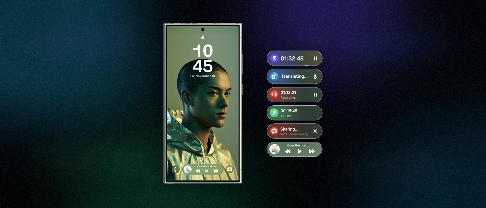

# NowBar SDK

> Android library module for Samsung Now Bar and Android 16 Live Updates.

<p align="center">
  
</p>

<p align="center">
  <a href="#english">🇬🇧 English</a>
  ·
  <a href="#ukrainian">🇺🇦 Українська</a>
  ·
  <a href="#russian">🇷🇺 Русский</a>
  ·
  <a href="#belarusian">🇧🇾 Беларуская</a>
</p>

---

<a id="english"></a>

## 🇬🇧 English

`nowbar-sdk` is a portable Android library module built around the `com.nowbar.api` package. It gives you one API for creating, updating, dismissing, and stopping ongoing Now Bar / Live Update style surfaces.

### Highlights

| Capability | Details |
| --- | --- |
| Native surfaces | Samsung Now Bar and Android 16 Live Updates |
| Fallback | Standard ongoing notification via `FallbackStrategy` |
| Integration style | Copy the [`nowbar/`](./nowbar) module into your project |
| Entry points | Direct manager API, session API, foreground service helper |

### Repository Layout

- [`nowbar/`](./nowbar) - Android library module
- [`examples/`](./examples) - ready-to-copy usage examples
- [`examples/TimerSessionExample.kt`](./examples/TimerSessionExample.kt) - session API example
- [`examples/TimerNowBarService.kt`](./examples/TimerNowBarService.kt) - foreground service example
- [`examples/WorkoutNowBarService.kt`](./examples/WorkoutNowBarService.kt) - workout example
- [`examples/NavigationNowBarService.kt`](./examples/NavigationNowBarService.kt) - navigation example
- [`examples/AndroidManifest.snippet.xml`](./examples/AndroidManifest.snippet.xml) - manifest snippet

### Core API

| API | Purpose |
| --- | --- |
| [`NowBarManager`](./nowbar/src/main/kotlin/com/nowbar/api/NowBarManager.kt) | Feature detection, channel creation, build/post/cancel |
| [`NowBarConfig`](./nowbar/src/main/kotlin/com/nowbar/api/NowBarConfig.kt) | Notification channel, notification id, fallback, Samsung surface options |
| [`NowBarSession`](./nowbar/src/main/kotlin/com/nowbar/api/NowBarSession.kt) | `start()`, `update()`, `dismiss()`, `stop()` |
| [`NowBarForegroundService`](./nowbar/src/main/kotlin/com/nowbar/api/service/NowBarForegroundService.kt) | Helper base class for long-running foreground-service flows |
| [`NowBarCard`](./nowbar/src/main/kotlin/com/nowbar/api/cards/NowBarCard.kt) | Base model for card content |

### Card Models

[`TimerCard`](./nowbar/src/main/kotlin/com/nowbar/api/cards/TimerCard.kt),
[`WorkoutCard`](./nowbar/src/main/kotlin/com/nowbar/api/cards/WorkoutCard.kt),
[`MediaCard`](./nowbar/src/main/kotlin/com/nowbar/api/cards/MediaCard.kt),
[`CallCard`](./nowbar/src/main/kotlin/com/nowbar/api/cards/CallCard.kt),
[`NavigationCard`](./nowbar/src/main/kotlin/com/nowbar/api/cards/NavigationCard.kt),
[`CustomCard`](./nowbar/src/main/kotlin/com/nowbar/api/cards/CustomCard.kt)

### Platform Support

| Platform | Behavior |
| --- | --- |
| Samsung devices with Now Bar support | Native Samsung ongoing-activity extras path |
| Android 16+ | Native Live Updates / promoted ongoing notification path |
| Unsupported devices | Plain ongoing notification for `AUTO` / `STANDARD_NOTIFICATION`, no SDK-managed posting for `NONE` |

Use `NowBarManager.isSupported(context)` to check whether a native enhanced surface is available, and `NowBarManager.getSupportedPlatform(context)` to inspect the detected platform.

### Requirements

- `minSdk = 26`
- `compileSdk = 36` or newer
- Java / Kotlin target `17`

### Integration

1. Copy the [`nowbar/`](./nowbar) folder into your Android project.
2. Register the module in your root `settings.gradle.kts`:

```kotlin
include(":nowbar")
```

3. Add the dependency in your app module:

```kotlin
dependencies {
    implementation(project(":nowbar"))
}
```

4. Merge the required manifest entries from [`nowbar/src/main/AndroidManifest.xml`](./nowbar/src/main/AndroidManifest.xml) or [`examples/AndroidManifest.snippet.xml`](./examples/AndroidManifest.snippet.xml):

```xml
<uses-permission android:name="android.permission.POST_NOTIFICATIONS" />
<uses-permission android:name="android.permission.POST_PROMOTED_NOTIFICATIONS" />
<uses-permission android:name="android.permission.FOREGROUND_SERVICE" />
<uses-permission android:name="android.permission.FOREGROUND_SERVICE_SPECIAL_USE" />

<application>
    <meta-data
        android:name="com.samsung.android.support.ongoing_activity"
        android:value="true" />
</application>
```

5. Request `POST_NOTIFICATIONS` at runtime on Android 13+.

`FOREGROUND_SERVICE_*` permissions depend on your service type. For example, the timer service uses `specialUse`, while the workout example uses `health|location`, so [`examples/AndroidManifest.snippet.xml`](./examples/AndroidManifest.snippet.xml) also includes `FOREGROUND_SERVICE_HEALTH`, `FOREGROUND_SERVICE_LOCATION`, and `android:foregroundServiceType="health|location"` for that service.

### Quick Start

```kotlin
val config = NowBarConfig(
    channelId = "timer",
    channelName = "Timer"
)

NowBarManager.createNotificationChannel(context, config)

val session = NowBarManager.createSession(context, config)

session.start(
    TimerCard(
        title = "Tea timer",
        icon = IconCompat.createWithResource(context, R.drawable.ic_timer),
        totalDuration = 5.minutes,
        remainingDuration = 5.minutes,
        isCountDown = true,
        accentColor = 0xFFFF9800.toInt()
    )
)

// update later
session.update(
    TimerCard(
        title = "Tea timer",
        icon = IconCompat.createWithResource(context, R.drawable.ic_timer),
        totalDuration = 5.minutes,
        remainingDuration = 3.minutes,
        isCountDown = true,
        accentColor = 0xFFFF9800.toInt()
    )
)

// keep the notification, hide promoted / Samsung surface
session.dismiss()

// cancel everything
session.stop()
```

### Notes

- If you do not need session state, you can build or post notifications directly through [`NowBarManager`](./nowbar/src/main/kotlin/com/nowbar/api/NowBarManager.kt).
- For long-running flows, use [`NowBarForegroundService`](./nowbar/src/main/kotlin/com/nowbar/api/service/NowBarForegroundService.kt).
- SDK-managed `notify` / `session` posting is skipped when the app cannot post notifications, for example when `POST_NOTIFICATIONS` is denied on Android 13+.
- `FallbackStrategy.AUTO` uses Samsung / Android 16 enhancements when available, otherwise keeps a plain ongoing notification.
- `FallbackStrategy.STANDARD_NOTIFICATION` always keeps a plain ongoing notification and never requests native enhancements.
- `FallbackStrategy.NONE` posts only when a native Samsung / Android 16 surface is available.
- `NowBarForegroundService` still has to keep a foreground notification because Android requires it, so `FallbackStrategy` there affects rendering, not the fact that `startForeground()` is used.

---

<a id="ukrainian"></a>

## 🇺🇦 Українська

`nowbar-sdk` — це Android-бібліотека навколо пакета `com.nowbar.api`. Вона надає єдиний API для створення, оновлення, приховування та зупинки карток і ongoing-сповіщень у стилі Samsung Now Bar та Android 16 Live Updates.

### Що всередині

| Можливість | Що це означає |
| --- | --- |
| Нативні поверхні | Samsung Now Bar та Android 16 Live Updates |
| Фолбек | Звичайне ongoing-сповіщення через `FallbackStrategy` |
| Формат інтеграції | Папка [`nowbar/`](./nowbar) копіюється прямо у ваш проєкт |
| Точки входу | Прямий manager API, session API та helper для foreground service |

### Структура репозиторію

- [`nowbar/`](./nowbar) - Android-бібліотека
- [`examples/`](./examples) - готові приклади інтеграції
- [`examples/TimerSessionExample.kt`](./examples/TimerSessionExample.kt) - приклад через session API
- [`examples/TimerNowBarService.kt`](./examples/TimerNowBarService.kt) - приклад через foreground service
- [`examples/WorkoutNowBarService.kt`](./examples/WorkoutNowBarService.kt) - приклад для workout-сценарію
- [`examples/NavigationNowBarService.kt`](./examples/NavigationNowBarService.kt) - приклад для навігації
- [`examples/AndroidManifest.snippet.xml`](./examples/AndroidManifest.snippet.xml) - фрагмент manifest

### Основне API

| API | Для чого потрібне |
| --- | --- |
| [`NowBarManager`](./nowbar/src/main/kotlin/com/nowbar/api/NowBarManager.kt) | Визначення підтримки, створення channel, build/post/cancel сповіщень |
| [`NowBarConfig`](./nowbar/src/main/kotlin/com/nowbar/api/NowBarConfig.kt) | Channel, notification id, fallback та параметри Samsung surface |
| [`NowBarSession`](./nowbar/src/main/kotlin/com/nowbar/api/NowBarSession.kt) | `start()`, `update()`, `dismiss()`, `stop()` |
| [`NowBarForegroundService`](./nowbar/src/main/kotlin/com/nowbar/api/service/NowBarForegroundService.kt) | Базовий helper для довгоживучих foreground service сценаріїв |
| [`NowBarCard`](./nowbar/src/main/kotlin/com/nowbar/api/cards/NowBarCard.kt) | Базова модель картки |

### Доступні картки

[`TimerCard`](./nowbar/src/main/kotlin/com/nowbar/api/cards/TimerCard.kt),
[`WorkoutCard`](./nowbar/src/main/kotlin/com/nowbar/api/cards/WorkoutCard.kt),
[`MediaCard`](./nowbar/src/main/kotlin/com/nowbar/api/cards/MediaCard.kt),
[`CallCard`](./nowbar/src/main/kotlin/com/nowbar/api/cards/CallCard.kt),
[`NavigationCard`](./nowbar/src/main/kotlin/com/nowbar/api/cards/NavigationCard.kt),
[`CustomCard`](./nowbar/src/main/kotlin/com/nowbar/api/cards/CustomCard.kt)

### Підтримка платформ

| Платформа | Поведінка |
| --- | --- |
| Samsung-пристрої з Now Bar | Нативний шлях через Samsung ongoing-activity extras |
| Android 16+ | Нативний шлях через Live Updates / promoted ongoing notification |
| Інші пристрої | Звичайне ongoing-сповіщення для `AUTO` / `STANDARD_NOTIFICATION`, без SDK-posting для `NONE` |

Перевірити наявність нативної поверхні можна через `NowBarManager.isSupported(context)`, а подивитися визначену платформу — через `NowBarManager.getSupportedPlatform(context)`.

### Вимоги

- `minSdk = 26`
- `compileSdk = 36` або новіше
- Java / Kotlin target `17`

### Підключення

1. Скопіюйте папку [`nowbar/`](./nowbar) у свій Android-проєкт.
2. Додайте модуль у кореневий `settings.gradle.kts`:

```kotlin
include(":nowbar")
```

3. Підключіть модуль у app-модулі:

```kotlin
dependencies {
    implementation(project(":nowbar"))
}
```

4. Додайте потрібні записи в manifest, взявши їх із [`nowbar/src/main/AndroidManifest.xml`](./nowbar/src/main/AndroidManifest.xml) або [`examples/AndroidManifest.snippet.xml`](./examples/AndroidManifest.snippet.xml):

```xml
<uses-permission android:name="android.permission.POST_NOTIFICATIONS" />
<uses-permission android:name="android.permission.POST_PROMOTED_NOTIFICATIONS" />
<uses-permission android:name="android.permission.FOREGROUND_SERVICE" />
<uses-permission android:name="android.permission.FOREGROUND_SERVICE_SPECIAL_USE" />

<application>
    <meta-data
        android:name="com.samsung.android.support.ongoing_activity"
        android:value="true" />
</application>
```

5. На Android 13+ запитайте `POST_NOTIFICATIONS` як runtime permission.

`FOREGROUND_SERVICE_*` permissions залежать від типу сервісу. Наприклад, timer-сервіс використовує `specialUse`, а workout-приклад використовує `health|location`, тому в [`examples/AndroidManifest.snippet.xml`](./examples/AndroidManifest.snippet.xml) додатково є `FOREGROUND_SERVICE_HEALTH`, `FOREGROUND_SERVICE_LOCATION` та `android:foregroundServiceType="health|location"` для цього сервісу.

### Швидкий старт

```kotlin
val config = NowBarConfig(
    channelId = "timer",
    channelName = "Timer"
)

NowBarManager.createNotificationChannel(context, config)

val session = NowBarManager.createSession(context, config)

session.start(
    TimerCard(
        title = "Таймер чаю",
        icon = IconCompat.createWithResource(context, R.drawable.ic_timer),
        totalDuration = 5.minutes,
        remainingDuration = 5.minutes,
        isCountDown = true,
        accentColor = 0xFFFF9800.toInt()
    )
)

// потім оновлюємо
session.update(
    TimerCard(
        title = "Таймер чаю",
        icon = IconCompat.createWithResource(context, R.drawable.ic_timer),
        totalDuration = 5.minutes,
        remainingDuration = 3.minutes,
        isCountDown = true,
        accentColor = 0xFFFF9800.toInt()
    )
)

// залишаємо сповіщення, але приховуємо promoted / Samsung surface
session.dismiss()

// повністю зупиняємо
session.stop()
```

### Примітки

- Якщо session API не потрібен, можна збирати й надсилати сповіщення безпосередньо через [`NowBarManager`](./nowbar/src/main/kotlin/com/nowbar/api/NowBarManager.kt).
- Для довгоживущих сценаріїв є [`NowBarForegroundService`](./nowbar/src/main/kotlin/com/nowbar/api/service/NowBarForegroundService.kt).
- SDK-прошарок для `notify` / `session` не публікує сповіщення, якщо застосунку зараз не можна їх показувати, наприклад, коли на Android 13+ не надано `POST_NOTIFICATIONS`.
- `FallbackStrategy.AUTO` вмикає Samsung / Android 16 enhancements, коли вони доступні, і залишає звичайне ongoing-сповіщення в інших випадках.
- `FallbackStrategy.STANDARD_NOTIFICATION` завжди залишає звичайне ongoing-сповіщення і не запитує нативні enhancements.
- `FallbackStrategy.NONE` публікує тільки за наявності нативної Samsung / Android 16 поверхні.
- `NowBarForegroundService` все одно зобов'язаний тримати foreground-сповіщення, тому що цього вимагає Android, тому там `FallbackStrategy` впливає на рендеринг, а не скасовує сам `startForeground()`.

---

<a id="russian"></a>

## 🇷🇺 Русский

`nowbar-sdk` — это Android-библиотека вокруг пакета `com.nowbar.api`. Она даёт единый API для создания, обновления, скрытия и остановки карточек и ongoing-уведомлений в стиле Samsung Now Bar и Android 16 Live Updates.

### Что внутри

| Возможность | Что это значит |
| --- | --- |
| Нативные поверхности | Samsung Now Bar и Android 16 Live Updates |
| Фоллбек | Обычное ongoing-уведомление через `FallbackStrategy` |
| Формат интеграции | Папка [`nowbar/`](./nowbar) копируется прямо в ваш проект |
| Точки входа | Прямой manager API, session API и helper для foreground service |

### Структура репозитория

- [`nowbar/`](./nowbar) - Android-библиотека
- [`examples/`](./examples) - готовые примеры интеграции
- [`examples/TimerSessionExample.kt`](./examples/TimerSessionExample.kt) - пример через session API
- [`examples/TimerNowBarService.kt`](./examples/TimerNowBarService.kt) - пример через foreground service
- [`examples/WorkoutNowBarService.kt`](./examples/WorkoutNowBarService.kt) - пример для workout-сценария
- [`examples/NavigationNowBarService.kt`](./examples/NavigationNowBarService.kt) - пример для навигации
- [`examples/AndroidManifest.snippet.xml`](./examples/AndroidManifest.snippet.xml) - фрагмент manifest

### Основное API

| API | Для чего нужно |
| --- | --- |
| [`NowBarManager`](./nowbar/src/main/kotlin/com/nowbar/api/NowBarManager.kt) | Определение поддержки, создание channel, build/post/cancel уведомлений |
| [`NowBarConfig`](./nowbar/src/main/kotlin/com/nowbar/api/NowBarConfig.kt) | Channel, notification id, fallback и параметры Samsung surface |
| [`NowBarSession`](./nowbar/src/main/kotlin/com/nowbar/api/NowBarSession.kt) | `start()`, `update()`, `dismiss()`, `stop()` |
| [`NowBarForegroundService`](./nowbar/src/main/kotlin/com/nowbar/api/service/NowBarForegroundService.kt) | Базовый helper для долгоживущих foreground service сценариев |
| [`NowBarCard`](./nowbar/src/main/kotlin/com/nowbar/api/cards/NowBarCard.kt) | Базовая модель карточки |

### Доступные карточки

[`TimerCard`](./nowbar/src/main/kotlin/com/nowbar/api/cards/TimerCard.kt),
[`WorkoutCard`](./nowbar/src/main/kotlin/com/nowbar/api/cards/WorkoutCard.kt),
[`MediaCard`](./nowbar/src/main/kotlin/com/nowbar/api/cards/MediaCard.kt),
[`CallCard`](./nowbar/src/main/kotlin/com/nowbar/api/cards/CallCard.kt),
[`NavigationCard`](./nowbar/src/main/kotlin/com/nowbar/api/cards/NavigationCard.kt),
[`CustomCard`](./nowbar/src/main/kotlin/com/nowbar/api/cards/CustomCard.kt)

### Поддержка платформ

| Платформа | Поведение |
| --- | --- |
| Samsung-устройства с Now Bar | Нативный путь через Samsung ongoing-activity extras |
| Android 16+ | Нативный путь через Live Updates / promoted ongoing notification |
| Остальные устройства | Обычное ongoing-уведомление для `AUTO` / `STANDARD_NOTIFICATION`, без SDK-posting для `NONE` |

Проверить наличие нативной поверхности можно через `NowBarManager.isSupported(context)`, а посмотреть определённую платформу — через `NowBarManager.getSupportedPlatform(context)`.

### Требования

- `minSdk = 26`
- `compileSdk = 36` или новее
- Java / Kotlin target `17`

### Подключение

1. Скопируйте папку [`nowbar/`](./nowbar) в свой Android-проект.
2. Добавьте модуль в корневой `settings.gradle.kts`:

```kotlin
include(":nowbar")
```

3. Подключите модуль в app-модуле:

```kotlin
dependencies {
    implementation(project(":nowbar"))
}
```

4. Добавьте нужные записи в manifest, взяв их из [`nowbar/src/main/AndroidManifest.xml`](./nowbar/src/main/AndroidManifest.xml) или [`examples/AndroidManifest.snippet.xml`](./examples/AndroidManifest.snippet.xml):

```xml
<uses-permission android:name="android.permission.POST_NOTIFICATIONS" />
<uses-permission android:name="android.permission.POST_PROMOTED_NOTIFICATIONS" />
<uses-permission android:name="android.permission.FOREGROUND_SERVICE" />
<uses-permission android:name="android.permission.FOREGROUND_SERVICE_SPECIAL_USE" />

<application>
    <meta-data
        android:name="com.samsung.android.support.ongoing_activity"
        android:value="true" />
</application>
```

5. На Android 13+ запросите `POST_NOTIFICATIONS` как runtime permission.

`FOREGROUND_SERVICE_*` permissions зависят от типа сервиса. Например, timer-сервис использует `specialUse`, а workout-пример использует `health|location`, поэтому в [`examples/AndroidManifest.snippet.xml`](./examples/AndroidManifest.snippet.xml) дополнительно есть `FOREGROUND_SERVICE_HEALTH`, `FOREGROUND_SERVICE_LOCATION` и `android:foregroundServiceType="health|location"` для этого сервиса.

### Быстрый старт

```kotlin
val config = NowBarConfig(
    channelId = "timer",
    channelName = "Timer"
)

NowBarManager.createNotificationChannel(context, config)

val session = NowBarManager.createSession(context, config)

session.start(
    TimerCard(
        title = "Таймер чая",
        icon = IconCompat.createWithResource(context, R.drawable.ic_timer),
        totalDuration = 5.minutes,
        remainingDuration = 5.minutes,
        isCountDown = true,
        accentColor = 0xFFFF9800.toInt()
    )
)

// потом обновляем
session.update(
    TimerCard(
        title = "Таймер чая",
        icon = IconCompat.createWithResource(context, R.drawable.ic_timer),
        totalDuration = 5.minutes,
        remainingDuration = 3.minutes,
        isCountDown = true,
        accentColor = 0xFFFF9800.toInt()
    )
)

// оставляем уведомление, но скрываем promoted / Samsung surface
session.dismiss()

// полностью останавливаем
session.stop()
```

### Примечания

- Если session API не нужен, можно собирать и отправлять уведомления напрямую через [`NowBarManager`](./nowbar/src/main/kotlin/com/nowbar/api/NowBarManager.kt).
- Для долгоживущих сценариев есть [`NowBarForegroundService`](./nowbar/src/main/kotlin/com/nowbar/api/service/NowBarForegroundService.kt).
- SDK-прослойка для `notify` / `session` не постит уведомление, если приложению сейчас нельзя их показывать, например когда на Android 13+ не выдан `POST_NOTIFICATIONS`.
- `FallbackStrategy.AUTO` включает Samsung / Android 16 enhancements, когда они доступны, и оставляет обычное ongoing-уведомление в остальных случаях.
- `FallbackStrategy.STANDARD_NOTIFICATION` всегда оставляет обычное ongoing-уведомление и не запрашивает нативные enhancements.
- `FallbackStrategy.NONE` постит только при наличии нативной Samsung / Android 16 поверхности.
- `NowBarForegroundService` всё равно обязан держать foreground-уведомление, потому что этого требует Android, поэтому там `FallbackStrategy` влияет на рендеринг, а не отменяет сам `startForeground()`.

---

<a id="belarusian"></a>

## 🇧🇾 Беларуская

`nowbar-sdk` — гэта Android-бібліятэка вакол пакета `com.nowbar.api`. Яна дае адзіны API для стварэння, абнаўлення, хавання і прыпынення картак і ongoing-апавяшчэнняў у стылі Samsung Now Bar і Android 16 Live Updates.

### Што ўнутры

| Магчымасць | Што гэта значыць |
| --- | --- |
| Натыўныя паверхні | Samsung Now Bar і Android 16 Live Updates |
| Фалбэк | Звычайнае ongoing-апавяшчэнне праз `FallbackStrategy` |
| Фармат інтэграцыі | Тэчка [`nowbar/`](./nowbar) капіруецца прама ў ваш праект |
| Кропкі ўваходу | Прамы manager API, session API і helper для foreground service |

### Структура рэпазіторыя

- [`nowbar/`](./nowbar) - Android-бібліятэка
- [`examples/`](./examples) - гатовыя прыклады інтэграцыі
- [`examples/TimerSessionExample.kt`](./examples/TimerSessionExample.kt) - прыклад праз session API
- [`examples/TimerNowBarService.kt`](./examples/TimerNowBarService.kt) - прыклад праз foreground service
- [`examples/WorkoutNowBarService.kt`](./examples/WorkoutNowBarService.kt) - прыклад для workout-сцэнарыя
- [`examples/NavigationNowBarService.kt`](./examples/NavigationNowBarService.kt) - прыклад для навігацыі
- [`examples/AndroidManifest.snippet.xml`](./examples/AndroidManifest.snippet.xml) - фрагмент manifest

### Асноўнае API

| API | Для чаго патрэбна |
| --- | --- |
| [`NowBarManager`](./nowbar/src/main/kotlin/com/nowbar/api/NowBarManager.kt) | Вызначэнне падтрымкі, стварэнне channel, build/post/cancel апавяшчэнняў |
| [`NowBarConfig`](./nowbar/src/main/kotlin/com/nowbar/api/NowBarConfig.kt) | Channel, notification id, fallback і параметры Samsung surface |
| [`NowBarSession`](./nowbar/src/main/kotlin/com/nowbar/api/NowBarSession.kt) | `start()`, `update()`, `dismiss()`, `stop()` |
| [`NowBarForegroundService`](./nowbar/src/main/kotlin/com/nowbar/api/service/NowBarForegroundService.kt) | Базавы helper для доўгажывучых foreground service сцэнарыяў |
| [`NowBarCard`](./nowbar/src/main/kotlin/com/nowbar/api/cards/NowBarCard.kt) | Базавая мадэль карткі |

### Даступныя карткі

[`TimerCard`](./nowbar/src/main/kotlin/com/nowbar/api/cards/TimerCard.kt),
[`WorkoutCard`](./nowbar/src/main/kotlin/com/nowbar/api/cards/WorkoutCard.kt),
[`MediaCard`](./nowbar/src/main/kotlin/com/nowbar/api/cards/MediaCard.kt),
[`CallCard`](./nowbar/src/main/kotlin/com/nowbar/api/cards/CallCard.kt),
[`NavigationCard`](./nowbar/src/main/kotlin/com/nowbar/api/cards/NavigationCard.kt),
[`CustomCard`](./nowbar/src/main/kotlin/com/nowbar/api/cards/CustomCard.kt)

### Падтрымка платформ

| Платформа | Паводзіны |
| --- | --- |
| Samsung-прылады з Now Bar | Натыўны шлях праз Samsung ongoing-activity extras |
| Android 16+ | Натыўны шлях праз Live Updates / promoted ongoing notification |
| Іншыя прылады | Звычайнае ongoing-апавяшчэнне для `AUTO` / `STANDARD_NOTIFICATION`, без SDK-posting для `NONE` |

Праверыць наяўнасць натыўнай паверхні можна праз `NowBarManager.isSupported(context)`, а паглядзець вызначаную платформу — праз `NowBarManager.getSupportedPlatform(context)`.

### Патрабаванні

- `minSdk = 26`
- `compileSdk = 36` або навей
- Java / Kotlin target `17`

### Падключэнне

1. Скапіруйце тэчку [`nowbar/`](./nowbar) у свой Android-праект.
2. Дадайце модуль у каранёвы `settings.gradle.kts`:

```kotlin
include(":nowbar")
```

3. Падключыце модуль у app-модулі:

```kotlin
dependencies {
    implementation(project(":nowbar"))
}
```

4. Дадайце патрэбныя запісы ў manifest, узяўшы іх з [`nowbar/src/main/AndroidManifest.xml`](./nowbar/src/main/AndroidManifest.xml) або [`examples/AndroidManifest.snippet.xml`](./examples/AndroidManifest.snippet.xml):

```xml
<uses-permission android:name="android.permission.POST_NOTIFICATIONS" />
<uses-permission android:name="android.permission.POST_PROMOTED_NOTIFICATIONS" />
<uses-permission android:name="android.permission.FOREGROUND_SERVICE" />
<uses-permission android:name="android.permission.FOREGROUND_SERVICE_SPECIAL_USE" />

<application>
    <meta-data
        android:name="com.samsung.android.support.ongoing_activity"
        android:value="true" />
</application>
```

5. На Android 13+ запытайце `POST_NOTIFICATIONS` як runtime permission.

`FOREGROUND_SERVICE_*` permissions залежаць ад тыпу сэрвісу. Напрыклад, timer-сэрвіс выкарыстоўвае `specialUse`, а workout-прыклад выкарыстоўвае `health|location`, таму ў [`examples/AndroidManifest.snippet.xml`](./examples/AndroidManifest.snippet.xml) дадаткова ёсць `FOREGROUND_SERVICE_HEALTH`, `FOREGROUND_SERVICE_LOCATION` і `android:foregroundServiceType="health|location"` для гэтага сэрвісу.

### Хуткі старт

```kotlin
val config = NowBarConfig(
    channelId = "timer",
    channelName = "Timer"
)

NowBarManager.createNotificationChannel(context, config)

val session = NowBarManager.createSession(context, config)

session.start(
    TimerCard(
        title = "Таймер гарбаты",
        icon = IconCompat.createWithResource(context, R.drawable.ic_timer),
        totalDuration = 5.minutes,
        remainingDuration = 5.minutes,
        isCountDown = true,
        accentColor = 0xFFFF9800.toInt()
    )
)

// потым абнаўляем
session.update(
    TimerCard(
        title = "Таймер гарбаты",
        icon = IconCompat.createWithResource(context, R.drawable.ic_timer),
        totalDuration = 5.minutes,
        remainingDuration = 3.minutes,
        isCountDown = true,
        accentColor = 0xFFFF9800.toInt()
    )
)

// пакідаем апавяшчэнне, але хаваем promoted / Samsung surface
session.dismiss()

// цалкам спыняем
session.stop()
```

### Заўвагі

- Калі session API не патрэбны, можна збіраць і адпраўляць апавяшчэнні наўпрост праз [`NowBarManager`](./nowbar/src/main/kotlin/com/nowbar/api/NowBarManager.kt).
- Для доўгажывучых сцэнарыяў ёсць [`NowBarForegroundService`](./nowbar/src/main/kotlin/com/nowbar/api/service/NowBarForegroundService.kt).
- SDK-праслойка для `notify` / `session` не посціць апавяшчэнне, калі праграме зараз нельга іх паказваць, напрыклад калі на Android 13+ не выдадзены `POST_NOTIFICATIONS`.
- `FallbackStrategy.AUTO` ўключае Samsung / Android 16 enhancements, калі яны даступныя, і пакідае звычайнае ongoing-апавяшчэнне ў астатніх выпадках.
- `FallbackStrategy.STANDARD_NOTIFICATION` заўсёды пакідае звычайнае ongoing-апавяшчэнне і не запытвае натыўныя enhancements.
- `FallbackStrategy.NONE` посціць толькі пры наяўнасці натыўнай Samsung / Android 16 паверхні.
- `NowBarForegroundService` усё роўна абавязаны трымаць foreground-апавяшчэнне, таму што гэтага патрабуе Android, таму там `FallbackStrategy` ўплывае на рэндэрынг, а не адмяняе сам `startForeground()`.
